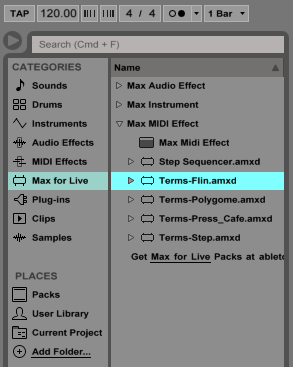
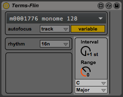
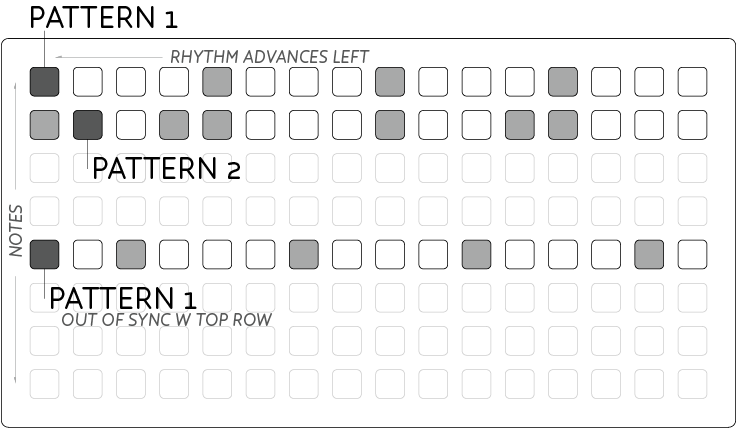
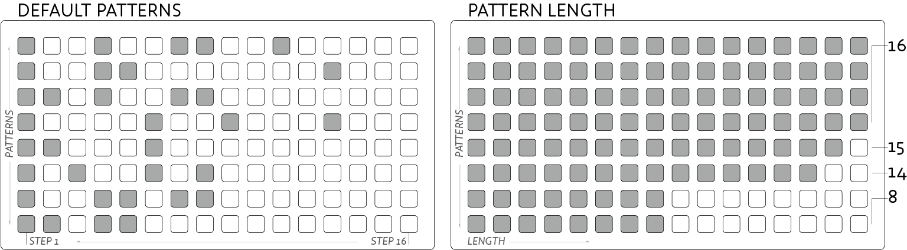

# Terms

*Terms*: *Sum* pulled apart. A collection of essential monome applications, synchronized and integrated within Ableton Live 9.

*Terms* is a collection of Max for Live *Devices* working together to create a complete performance system within Ableton Live. Each device implements a monome application, incorporating a unified interface within Ableton Live. These apps are simplified for easy exploration with enhanced visual feedback for vari-bright grids.

Expanded versions, and other Max for Live adaptations of grid-focused apps are available from community member [elquinto's github](https://github.com/el-quinto).

## Installation

In lieu of an automated installer (coming soon directly from Ableton), there are two methods to install the Devices into your Ableton Library. If you know your way around your Ableton User Library folder, skip to option 2, otherwise you're best bet is to do this manually:

- Download the [Latest Release](https://github.com/monome/Terms/releases/latest) of *Terms* from github.
- Unzip the file and look in the unzipped folder `Terms-x-x`.
- Start a new Ableton Session.
- Drag all six files into a Track's Devices strip one at a time.
- Click the small 'Save' button in the top-right of each Device.

This will add the Devices into your User Library so next time you can simply navigate to the `Max for Live` Devices category in the Browser to add the given device.

### Direct Installation

Instead of the manually loading & saving each Device, you can place the .amxd files directly in your User Library folder.

On Mac this directory is located in your User folder, and you'll need to place the different Devices in three different sub-folders. You can check the location of your User Library in Ableton's Preferences window under the `Library` tab at left – it's the last entry.

Place *Flin*, *Polygome*, *Press_Cafe* and *Step* in:
`~/Music/Ableton/User Library/Presets/MIDI Effects/Max MIDI Effect`

Place *Launchd* in:
`~/Music/Ableton/User Library/Presets/Audio Effects/Max Audio Effect`

Place *Synth* in:
`~/Music/Ableton/User Library/Presets/Instruments/Max Instrument`

## Getting Started

Now that the Devices have been added to your User Library they can be easily instantiated in Ableton via the Device Browser as pictured below. Drag your desired Device onto a track and the application should automatically grab control of a connected monome grid.

If the grid isn't instantly focussed on the Device, select your grid from the dropdown at the top of the Device.

## Devices

There are six included *Devices* in the *Terms* bundle:

### Flin

A cyclic poly-rhythm music box, where each column represents a voice. Notes are arranged left (lowest), to right (highest). The vertical dimension represents time, where top is fastest and bottom slowest.

- Press a key to start cycling a note.
- Push the bottom row to mute that note.
- Cycle rate is set by the vertical location of the key press. Faster notes toward the top.
- Duration can be changed by holding a press and pressing elsewhere in the column. The second press sets duration, longer toward the bottom.

Set the overall speed range of *Flin* with the `rhythm` dropdown. `16n` will provide standard speed, while 32n will double the rate, and 8n will half it.

#### Pitch & Scaling

All of the note generating Devices in *Terms* have a unified **Pitch & Scaling** section allowing for rapid tuning and automation of note choices per device.

- Two drop downs at bottom select the musical key and scale.
- **Interval** sets the musical interval between adjacent notes. Larger values spread notes out, while smaller values approach chromatic separation.
- **Range** sets the harmonic range of output notes.

To the right of the Scaling options a narrow display shows the currently output notes as horizontal lines. This display is calibrated to match Ableton's Drum Rack note display in order to visualize the range of notes currently being output.

**nb: Use the `Chromatic` scale when attempting to trigger adjacent drum samples.**

### Step

A simple step sequencer for triggering drum sounds or melodies.

- Enter triggers with key presses. Notes will light when active.
- Top row shows the curent playhead.
- Press keys in the top row to jump to a new playback position.
- Set a playback loop by holding the new playback position, and pressing another top-row key to set the end position.

Step includes the same **Rhythm** setting as *Flin* which can be used to change the rate of the step sequencer. The sequencer will restart whenever Live's transport is reset to the start.

Step includes the same **Pitch & Scaling** options as *Flin*. Use the `Chromatic` scale mode to trigger sounds in a drum rack, or automate the `Pitch` and `Interval` controls for shifting melodic patterns.

### Polygomé

A dynamic pattern instrument, creating automatic melodies & arpeggiations. The grid maps pitches increasing from top-left to bottom-right.

- Hold keys to play the current pattern starting from the given root note.
- Pitches are arranged with diatonic scales horizontally and fourths vertically.
- Multiple notes can be played simultaneously by holding multiple keys.
- The current playback pattern is selected in the top-row.
- 'Loop' mode is toggled with the top-left key for sustained arpeggios.

The **Rhythm** settings are carried over from *Flin* in addition to the `goméizer` which allows the arpeggiation sequences to be modified. Select from the `preset` options that appear, and hit `GO!` to hear how the pattern is changed. The individual sliders and toggles can be set by hand if you want more specific control over how the patterns are created.

Polygomé includes the same **Pitch & Scaling** options as *Flin* above. Changing the *Interval* setting will radically reconfigure the layout of notes on the grid.

### Press Cafe

A pattern performance instrument for polyrhythmic sequences. Notes are arranged vertically, while rhythms are arranged horizontally. Press different keys in the same row to play the same note with different patterns.

- Press and hold a key in a given row to start the rhythm. Release to stop.
- Hold multiple rows for interlocking patterns.

`Rhythm` and `Note Length` settings are provided to fine tune the rhythmic patterns.

The default mode is `Play` mode, while `Edit` and `Length` modes allow you to change the rhythmic patterns, and loop lengths of the first 8 patterns. In these modes the patterns of the first 8 keys in a row are represented vertically descending. `Length` settings other than 16 will allow for polyrhythms to occur when holding more than one row.

The **Pitch & Scaling** settings from *Flin* are again repeated here.

### Launchd

A simple clip launcher for navigating Live sets and having hands-on control of your sounds. This is an `Audio Effect` device designed to be placed on the `Master` bus for global control of your Live Set.

The bottom row and far right column are reserved for special functions. The remainder of the grid is a physical *Session View* for launching clips:

- Loaded clips are displayed with mid-brightness leds.
- Play a clip by pressing an available clip.
- When launching a clip it will flash until it begins playing when it will brighten.
- Retrigger clips by pressing them again as you would in Session view.
- If a track is armed for recording, pressing an empty slot will begin recording.

The bottom row provides a track stop key for each track in the order they're displayed in your Live set:

- All existing tracks will dimly light their bottom key.
- Any track with a currently playing clip will have a brightly lit key.
- Press this lit key to stop the currently playing clip.

The far right row gives access to Scenes:

- Keys will light when there are clips in the respective Scene.
- Pressing this key will cue all the clips in the Scene.

The bottom-right key is a special *navigation* key for moving through the Live Set:

- Press and hold the bottom-right key
- The two keys immediately above will dimly light.
- While still holding, press the lower of the two buttons to move down through the Scenes.
- Alternatively press the higher of the two lit keys to move back upward through the set.

  
## Terms Synth

*Terms* includes a simple, yet flexible synthesis engine for rapid sound design. To create such a broad palette of sounds the synth uses both FM & subtractive synthesis approaches, plus an Attack-Decay envelope to control volume, with additional modulation routing options.

*Pitch* allows the tuning of the synth to be finetuned to match with samples or live instruments. The small *env* slider modulates the pitch with the *envelope* in either positive or negative direction, according to the slider.

*Timbre* fades smoothly between different oscillator waveforms allowing for smooth control over harmonic content. *Noise* can be mixed in with the oscillator, which is particularly useful for percussion sounds.

The oscillator is processed by the *Filter* for sculpting the sonic response. *Cutoff* shifts the point at which the filter begins to take action. *Q* adds resonance, or emphasis, around the cutoff frequency. *Env* allows the Cutoff control to be modulated by the *envelope*.

The last *Filter* slider allows the response of the filter to be faded between many different responses. At either end is the classic Lowpass response, with the less common Bandpass, Highpass, and Band Reject (Notch) responses in between. Mixing smoothly between these responses allows subtle shifts between the standard responses.

*Frequency Modulation* controls a second, slave oscillator, for frequency modulating the main oscillator. *FM multiplier* sets the harmonic relationship between the oscillators, where higher multiples add upper harmonics to the sound, where lower settings add low frequencies and sub-octave tones. *FM Index* controls how much modulation should be applied to the main oscillator. *Env* allows the FM Index to be modulated according to the *envelope*.

*Envelope* is a slow changing modulation triggered each time a note is received. The output volume of the synth is always controlled by envelope. *Length* controls the duration of the modulation. The envelope contains attack and decay sections where *Shape* alters the linearity of these slopes - lower settings for softer attacks, higher settings for smoother tails. *Slope* shifts the amount of time spent in attack versus decay - lower settings for quick percussive attacks, higher settings for swelling synth tones.

With the *Sustain* switch turned off, any received note will play through the entire *Envelope*. Alternately switching *Sustain* on, creates an 'Attack-Decay-Release' envelope shape, where a held note will stop at the top of the envelope until the note is released when it will return to zero. Similarly, very short notes will shift directly into the *Release* stage when a note is released even if the *Attack* phase isn't finished.

Finally a *Volume* fader is provided for setting the gain of the synth as it has a very wide dynamic range.

## Auto-Focus

All *Terms* Devices, except *Synth*, require the use of a monome grid. To streamline the workflow, the Devices will automatically focus on the first available grid device when added to your Live Set. Manually selecting a different grid will overwrite the default behaviour and your choice will be saved in the Live Set.

As there can be many grid-capable devices available in a single Live Set, the **auto-focus** technique is used to dynamically switch which application is currently displayed on the grid. The default behaviour is that focus will be grabbed whenever selecting the respective Track in the Live Set.

**Auto-focus** can be disabled from the dropdown, or can be set to `Device` mode where focus will only change when explicitly selecting the *Terms* Device inside a Track's Device strip.

	
## Credits

*Terms* was created by [monome.org](monome.org) using Max 7 & Ableton Live 9.

This manual was created by [Trent Gill](http://www.whimsicalraps.com) for [monome.org](monome.org).

Contributions welcome. Submit a pull request to [github.com/monome/terms](https://github.com/monome/terms) or e-mail [info@monome.org](mailto:info@monome.org).
